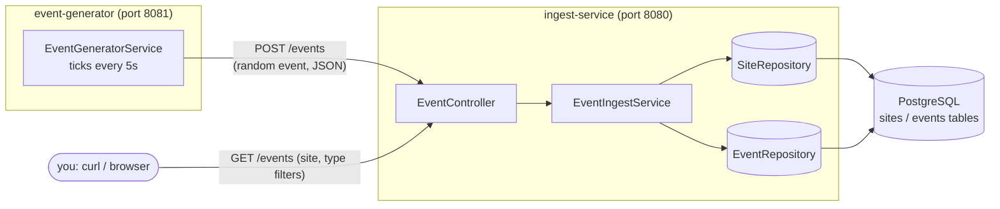
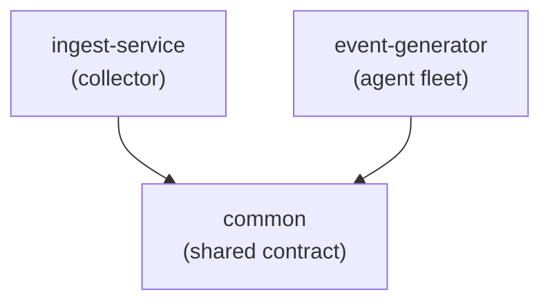

# miniDEM

A miniature "network health monitor" that mirrors, in small scale, what a real Digital
Experience Monitoring (DEM) system does: watch network telemetry from many sites and make
it queryable. It is a **learning project**, not production software — see [CLAUDE.md](CLAUDE.md)
for the full motivation and [PROGRESS.md](PROGRESS.md) for the phase-by-phase build log.

This document covers the whole repository: what it's made of, how the pieces talk to each
other, and how to run it. Each runnable service also has its own README going file-by-file
and class-by-class, written for engineers who don't know Java or Spring:

- [`ingest-service/README.md`](ingest-service/README.md) — the collector
- [`event-generator/README.md`](event-generator/README.md) — the simulated agent fleet

## What it does, in one paragraph

`event-generator` pretends to be a fleet of network probes: on a timer, it invents a
plausible-looking network event (a latency spike, packet loss, etc.) for a random site and
sends it over HTTP to `ingest-service`. `ingest-service` is the collector: it validates the
event, stores it in PostgreSQL, and exposes a REST endpoint so you can query what's been
observed — optionally filtered by site or event type. Nothing here is measuring a real
network; the values are randomly generated. What's real is the *shape* of the pipeline —
two independent services talking over a network boundary, one ingesting, one serving
queries — which is the part worth learning.

## Architecture



`event-generator` never touches the database directly — it only knows how to speak HTTP to
`ingest-service`. That separation is deliberate: it's the same shape a real agent-to-collector
pipeline has, and it means the two services could run on entirely different machines with no
code changes.

## Repository layout

This is a **Maven multi-module project**: one root `pom.xml` coordinates three independently
buildable sub-projects. If you're coming from .NET, this is the same idea as a `.sln` with
multiple `.csproj` projects inside it; if you're coming from Go, it's like one repo with
`cmd/ingest/` and `cmd/generator/` each building a separate binary.

```
minidem/
├── pom.xml                  # parent/aggregator — lists the 3 modules, shared build config
├── docker-compose.yml       # local PostgreSQL for development
├── mvnw, mvnw.cmd, .mvn/    # Maven Wrapper — pins the exact Maven version, no global install needed
├── CLAUDE.md                # project charter / why this exists
├── PROGRESS.md              # phase-by-phase implementation checklist
│
├── common/                  # shared wire contract — plain Java, no Spring dependency
│   └── .../common/
│       ├── IngestEventRequest.java   # the JSON shape sent from generator to collector
│       ├── EventType.java            # LATENCY_SPIKE | PACKET_LOSS | JITTER | CONNECTIVITY_LOSS
│       └── MetricUnit.java           # MS | PERCENT | COUNT
│
├── ingest-service/          # the collector — REST API + PostgreSQL persistence
│   └── (see ingest-service/README.md for full file-by-file detail)
│
└── event-generator/         # the simulated agent fleet — HTTP client only, no database
    └── (see event-generator/README.md for full file-by-file detail)
```

Both `ingest-service` and `event-generator` depend on `common`, so the two services always
agree on the exact shape of the data crossing the wire between them. `common` itself has zero
framework dependencies — it's plain Java, deliberately, so it isn't tied to either service's
internals.



## Tech stack

| Piece | What / why |
|---|---|
| Java 25, Spring Boot 3.5 | Application runtime and framework |
| Maven (multi-module) + Maven Wrapper | Build tool; wrapper means no global Maven install is required |
| PostgreSQL 16 (via Docker) | Durable event history |
| Spring Data JPA / Hibernate | Object-relational mapping — Java classes ↔ database tables |
| Spring MVC (`spring-boot-starter-web`) | REST endpoints (`ingest-service`) and the outbound HTTP client (`event-generator`) |
| H2 (in-memory) | Used only in `ingest-service`'s tests, so tests don't touch the real database |

Not yet in the picture (see `PROGRESS.md`'s roadmap table): gRPC, Kafka, Redis, GraphQL,
Grafana, Kubernetes. This session's scope is deliberately just HTTP + Postgres + REST.

## Running it

### Prerequisites

- **Docker Desktop** (for PostgreSQL) — running before you start `ingest-service`.
- **A JDK** (25 or newer). You do **not** need Maven installed globally — the checked-in
  wrapper (`mvnw` / `mvnw.cmd`) downloads the pinned Maven version automatically the first
  time you run it.

### 1. Start PostgreSQL

```bash
docker compose up -d
```

This starts a `postgres:16` container named `minidem-postgres`, with a database/user/password
matching what `ingest-service` expects out of the box (`minidem`/`minidem`/`minidem`), and a
named Docker volume so your data survives container restarts.

### 2. Build everything

From the repository root:

```bash
./mvnw clean package        # Linux/macOS/Git Bash
mvnw.cmd clean package      # Windows cmd/PowerShell
```

This builds `common` first (the other two depend on it), then `ingest-service` and
`event-generator`, running each module's tests along the way. It produces two runnable
"fat jars" (self-contained, embedded web server included):

- `ingest-service/target/ingest-service.jar`
- `event-generator/target/event-generator.jar`

### 3. Run the collector

```bash
java -jar ingest-service/target/ingest-service.jar
```

Boots on **port 8080**, connects to Postgres, creates/updates the `sites` and `events` tables
automatically, and seeds six fixed sites on first boot. Leave this running in its own
terminal.

### 4. Run the agent fleet

In a second terminal:

```bash
java -jar event-generator/target/event-generator.jar
```

Boots on **port 8081** and immediately starts sending one random event to `ingest-service`
every 5 seconds. Watch its logs — you'll see a line per successful send.

### 5. Query what's been collected

```bash
curl http://localhost:8080/events
curl "http://localhost:8080/events?site=tel-aviv-office"
curl "http://localhost:8080/events?type=PACKET_LOSS"
```

See [`ingest-service/README.md`](ingest-service/README.md#manual-testing) for the full set of
manual test commands, including the error-path ones (unknown site, invalid event type).

### Stopping / cleaning up

- Stop each Java process with `Ctrl+C` in its terminal.
- `docker compose down` stops and removes the Postgres container (data survives, it's in a
  named volume).
- `docker compose down -v` additionally wipes the volume, so the next boot starts from an
  empty database (the six sites will be re-seeded).

## Where to go next

- Read [`ingest-service/README.md`](ingest-service/README.md) and
  [`event-generator/README.md`](event-generator/README.md) for a full walkthrough of every
  class, plus sequence and class diagrams for each service.
- [`PROGRESS.md`](PROGRESS.md) tracks what's implemented and what's planned next
  (gRPC, Kafka, Redis, GraphQL, Grafana, Kubernetes).
