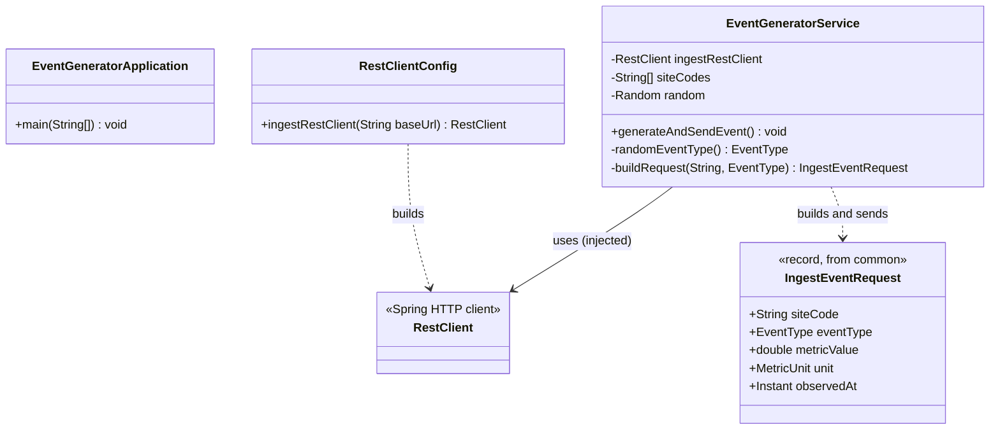
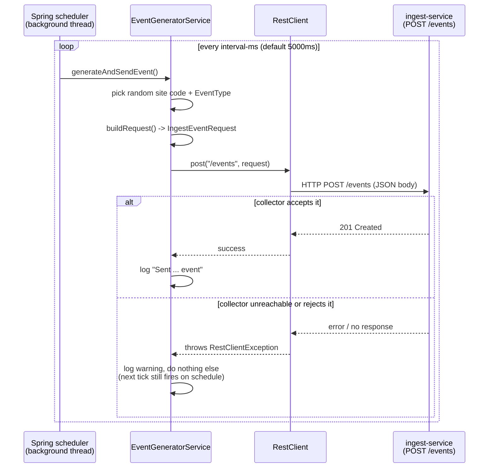

# event-generator

Plays the role of a fleet of network probes/agents. On a timer, it invents one plausible
network event for a randomly chosen site and sends it to `ingest-service` over plain HTTP.
It never touches a database — it's a pure HTTP client that happens to run as its own small
web-capable service. This document explains every file and class here in plain terms; no
prior Java or Spring knowledge assumed.

For the system-wide picture (how this fits with `ingest-service` and `common`), see the
[repository root README](../README.md).

## What "Spring Boot" is doing, briefly

Spring scans this module's code at startup for classes marked with specific `@Annotation`s
and automatically constructs and wires them together — there's no central file that manually
builds an `EventGeneratorService` and hands it its dependencies; that happens implicitly
based on annotations and constructor parameters. Each class below explains its annotations
the first time they appear.

## File-by-file walkthrough

### `EventGeneratorApplication.java` — the entry point

The `main()` method that starts this service, embedded web server included.
`@SpringBootApplication` triggers Spring's class-scanning, and `@EnableScheduling` is the
opt-in switch that makes `@Scheduled` methods anywhere in this module actually run — without
it, `EventGeneratorService`'s timer method would simply never be invoked, with no error or
warning.

### `config/RestClientConfig.java` — how this service knows where to send events

Produces one shared `RestClient` (Spring's HTTP client) pre-configured with the collector's
base URL, read from configuration (`minidem.ingest.base-url`, see below). Everywhere else in
this module that needs to make an HTTP call just asks for that pre-built client rather than
constructing one from scratch each time.

### `EventGeneratorService.java` — the actual "agent"

The one class doing real work. `@Scheduled(fixedRateString = "${minidem.generator.interval-ms}")`
means Spring calls its `generateAndSendEvent()` method automatically, on a background thread,
every N milliseconds (5000 by default) — again, no code anywhere explicitly calls this method;
the annotation is the entire wiring. Each tick:

1. Picks a random site code from a configured list, and a random `EventType`.
2. Fabricates a plausible-looking numeric value for that event type (e.g. ~20-300ms for a
   latency spike, 0-15% for packet loss).
3. Sends it as an `IngestEventRequest` (the shared contract type from `common`) via an HTTP
   `POST /events` to `ingest-service`, using the client from `RestClientConfig`.
4. Logs success, or — if the collector is briefly unreachable or rejects the request — logs a
   warning and simply waits for the next tick. One failed send never stops future ticks.

### `application.properties` — configuration

Three settings specific to this service:

| Key | Meaning |
|---|---|
| `minidem.ingest.base-url` | Where `ingest-service` lives (default `http://localhost:8080`) |
| `minidem.generator.site-codes` | Comma-separated list of site codes this "fleet" pretends to be — must match what `ingest-service` has seeded |
| `minidem.generator.interval-ms` | How often (in milliseconds) to generate and send one event |

Any of these can be overridden without touching the file, e.g. to point at a collector
running somewhere else:

```bash
java -jar event-generator.jar --minidem.ingest.base-url=http://some-other-host:8080
```

## Class diagram



## Sequence diagram: one tick



## Running this service on its own

`event-generator` needs `ingest-service` reachable to succeed (though it tolerates it being
down — see the sequence diagram above), which in turn needs PostgreSQL. From the repository
root:

```bash
docker compose up -d
./mvnw -pl ingest-service -am package
java -jar ingest-service/target/ingest-service.jar &   # start the collector first
```

Then build and run this service:

```bash
./mvnw -pl event-generator -am package    # -am also builds "common", which this depends on
java -jar event-generator/target/event-generator.jar
```

It boots on **port 8081** and starts ticking immediately — no manual trigger needed.

## Manual testing

There's no HTTP endpoint of its own worth curling (it only exposes a default, empty Tomcat
instance on 8081) — "testing" this service means observing its *behavior*:

**1. Watch it successfully send events**, with `ingest-service` running:
```bash
# in the terminal running event-generator, watch for lines like:
# Sent PACKET_LOSS event for site tel-aviv-office (8.3 PERCENT)
```
Cross-check against the collector — the count should be climbing:
```bash
docker exec minidem-postgres psql -U minidem -d minidem -c "SELECT count(*) FROM events;"
# run again a few seconds later and confirm the number increased
```

**2. Watch it tolerate the collector being down** — this is the resilience behavior worth
seeing directly, not just reading in the code. Stop `ingest-service` (`Ctrl+C`) while
`event-generator` keeps running. You should see a `WARN` log per tick along the lines of:
```
Failed to send event for site nyc-branch: I/O error on POST request for "http://localhost:8080/events": ...
```
and — importantly — the process keeps running and keeps trying every subsequent tick; it
does not crash or stop. Restart `ingest-service` and confirm the next tick succeeds again
with no restart of `event-generator` needed.

**3. Change the tick interval or site list without touching code** — edit
`src/main/resources/application.properties` (or pass `--minidem.generator.interval-ms=1000`
on the command line) and restart to see the effect, confirming the schedule is genuinely
driven by configuration rather than a hardcoded value.

## Running the tests

```bash
./mvnw -pl event-generator -am test
```

The context-load test boots the full application, including the `@Scheduled` service. If
`ingest-service` isn't running at that moment, you'll see the same `WARN` log from a real
tick firing during the test — that's expected, not a test failure; it's the try/catch in
`EventGeneratorService` working exactly as designed.
