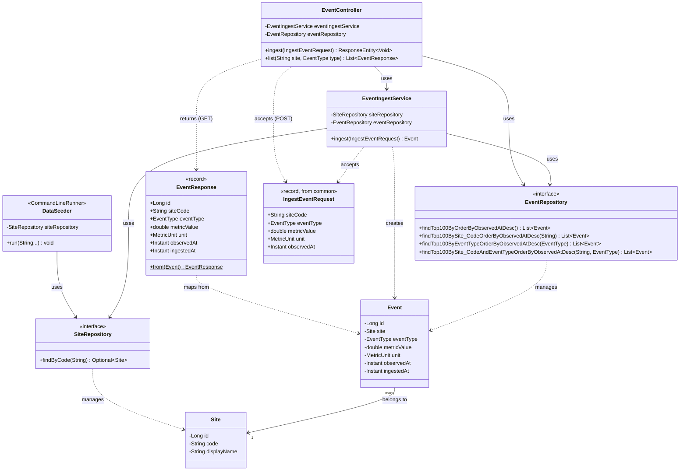
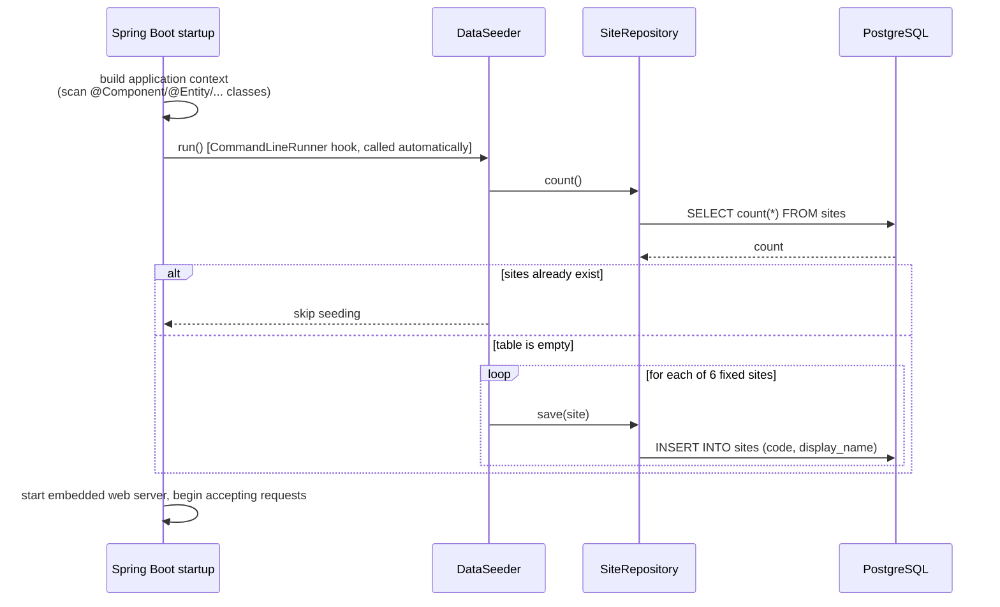
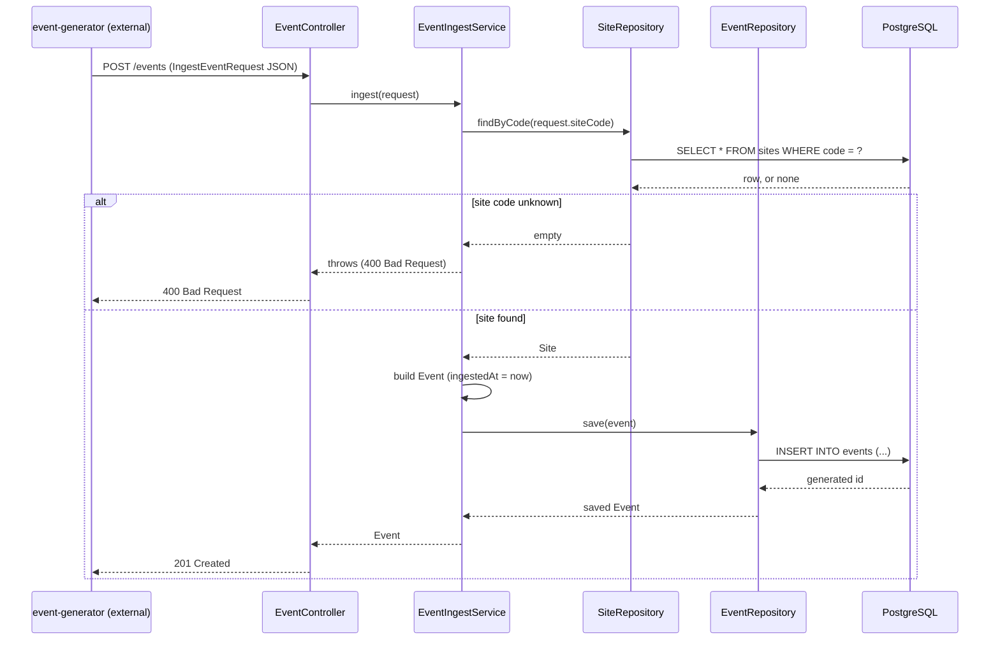
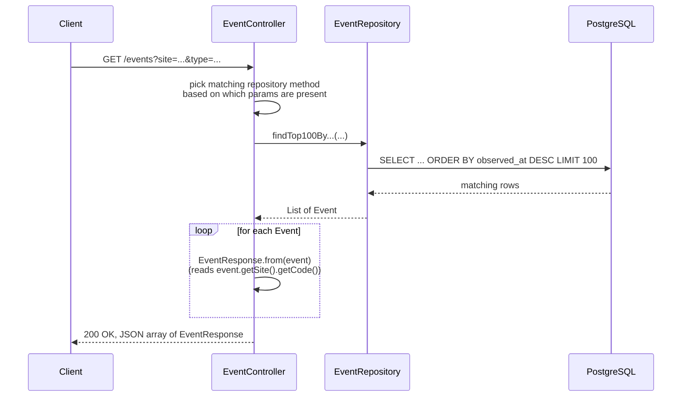

# ingest-service

The collector. Receives network events over HTTP, stores them in PostgreSQL, and serves a
REST endpoint to query them back out. This document explains every file and class in this
module in plain terms — you don't need to know Java or Spring to follow it, though a few
framework-specific mechanisms are called out explicitly where the behavior isn't obvious
from reading the code alone.

For the system-wide picture (how this fits with `event-generator` and `common`), see the
[repository root README](../README.md).

## What "Spring Boot" is doing, briefly

If you've never seen a Spring application before, the one thing to know up front: Spring
scans this module's code at startup looking for classes marked with specific `@Annotation`s
(`@Component`, `@Service`, `@RestController`, etc.), and automatically constructs and wires
them together — you won't find a central file that manually creates an `EventController` and
hands it its dependencies. That wiring happens implicitly, based on those annotations plus
each class's constructor parameters. Every class below notes what its annotation means the
first time it comes up.

## File-by-file walkthrough

Reading order follows dependencies: types with no dependencies on other files in this module
first, then the things that build on top of them.

### `IngestServiceApplication.java` — the entry point

The `main()` method that starts the whole service — an embedded web server included, no
separate deployment step. `@SpringBootApplication` is what triggers the class-scanning
described above, rooted at this class's package (`com.yanshlain.minidem.ingest`) and
everything under it.

### `domain/Site.java` — a monitored location

Represents one "site" (e.g. a branch office or cloud region) being monitored. Backed by a
`sites` table in Postgres. `@Entity` is what tells the persistence framework (Hibernate)
"map this class to a database table, and map each row back into an instance of this class."
Fields: an auto-generated numeric `id`, a unique `code` (e.g. `"tel-aviv-office"`, the stable
identifier both services agree on), and a human-readable `displayName`.

### `domain/Event.java` — one observed network condition

One row = one event (a latency spike, packet loss reading, etc.) tied to a `Site`. Backed by
an `events` table. Fields: `eventType` (one of `common`'s `EventType` values), `metricValue` +
`unit` (the number and what it means), and two separate timestamps —

- `observedAt` — when the condition supposedly happened (set by the sender, `event-generator`)
- `ingestedAt` — when this service actually received and stored it (set here, on arrival)

kept deliberately distinct, the way real telemetry systems distinguish "event time" from
"processing time." The link back to `Site` is a foreign key (`site_id` column), modeled as a
"many events belong to one site" relationship. That relationship is loaded lazily — Hibernate
doesn't fetch the related `Site` row until code actually asks for it — which matters later in
`EventResponse` below.

### `repo/SiteRepository.java` and `repo/EventRepository.java` — the database access layer

These are Java `interface`s (a contract with no implementation body) — and that's the whole
point: Spring Data JPA reads the interface and *generates a working implementation
automatically* at startup, based on inherited methods (`save`, `findById`, `count`, ...) and
on method names it parses itself. For example, `findByCode(String code)` on
`SiteRepository` becomes, automatically, `SELECT * FROM sites WHERE code = ?` — no SQL, no
implementation, written anywhere. `EventRepository` has four such generated methods, covering
every combination of "filter by site," "filter by event type," and "newest first, capped at
100 rows" that the query endpoint needs.

### `config/DataSeeder.java` — fills in six starter sites on first boot

Runs once, automatically, right after the application finishes starting up (implementing
`CommandLineRunner` is how you hook into that moment in Spring Boot — nothing calls this
class directly). Checks whether the `sites` table is already populated; if not, inserts six
fixed sites (`tel-aviv-office`, `berlin-office`, `nyc-branch`, `singapore-pop`,
`aws-us-east-1`, `aws-eu-west-1`). Idempotent — restarting the service doesn't create
duplicates.

### `service/EventIngestService.java` — turns an incoming request into a stored row

The one piece of actual business logic in this service. Given an `IngestEventRequest` (the
shared contract type from `common`), it: looks up the `Site` by the code in the request,
rejects the request with an HTTP `400` if that code is unknown, builds an `Event` (stamping
`ingestedAt` with the current time), and saves it. The whole method runs inside a database
transaction (`@Transactional`) — if anything fails partway through, nothing is left
half-written.

### `web/EventController.java` — the HTTP layer

The class that actually exposes `/events` over HTTP. `@RestController` means every method's
return value gets serialized straight to JSON in the HTTP response — this is the same shape
of thing as a controller in any other web framework (ASP.NET, Express, Flask, ...), just with
Spring's specific annotations for routing:

- `@PostMapping("/events")` — accepts a JSON body, deserializes it into an `IngestEventRequest`
  automatically, hands it to `EventIngestService`, returns `201 Created` on success (or lets
  the `400` from the service layer propagate).
- `@GetMapping("/events")` — accepts two *optional* query parameters, `site` and `type`, picks
  the matching `EventRepository` method based on which are present, and maps each result to
  an `EventResponse` before returning the list.

### `web/EventResponse.java` — the shape returned by `GET /events`

A small, flat value type — not the `Event` entity itself. Two reasons: it keeps the public
API shape independent of the database schema, and it avoids serializing Hibernate's internal
lazy-loading machinery straight into JSON. Its one interesting line reads `site.getCode()` off
an `Event`'s lazily-loaded `Site` — which works here because Spring Boot keeps the database
session open for the duration of the whole HTTP request by default (a setting called "Open
Session In View"). That's convenient for a project this size; a larger production system
would typically disable it and fetch everything needed up front instead, to keep query
behavior easier to reason about.

## Class diagram



## Sequence diagrams

### Startup: seeding the six fixed sites



### Ingestion: `POST /events`



### Query: `GET /events`



## Running this service on its own

`ingest-service` needs PostgreSQL reachable — from the repository root:

```bash
docker compose up -d
```

Then build and run (from the repository root, since it's part of the multi-module build):

```bash
./mvnw -pl ingest-service -am package    # -am also builds "common", which this depends on
java -jar ingest-service/target/ingest-service.jar
```

It boots on **port 8080**. Configuration lives in
[`src/main/resources/application.properties`](src/main/resources/application.properties) —
notably the Postgres connection details and `spring.jpa.hibernate.ddl-auto=update`, which
means the `sites`/`events` tables are created/updated automatically from the `@Entity`
classes on every boot; nothing to run by hand.

## Manual testing

With the service running, these `curl` commands exercise every path:

**Ingest a valid event:**
```bash
curl -i -X POST http://localhost:8080/events \
  -H "Content-Type: application/json" \
  -d '{"siteCode":"tel-aviv-office","eventType":"PACKET_LOSS","metricValue":12.5,"unit":"PERCENT","observedAt":"2026-07-15T14:00:00Z"}'
```
Expect `201 Created`.

**Ingest with an unknown site code (error path):**
```bash
curl -i -X POST http://localhost:8080/events \
  -H "Content-Type: application/json" \
  -d '{"siteCode":"nonexistent-site","eventType":"LATENCY_SPIKE","metricValue":42.0,"unit":"MS","observedAt":"2026-07-15T14:00:00Z"}'
```
Expect `400 Bad Request`, and no row written.

**List everything (newest first, capped at 100):**
```bash
curl http://localhost:8080/events
```

**Filter by site:**
```bash
curl "http://localhost:8080/events?site=tel-aviv-office"
```

**Filter by event type:**
```bash
curl "http://localhost:8080/events?type=PACKET_LOSS"
```

**Filter by both:**
```bash
curl "http://localhost:8080/events?site=tel-aviv-office&type=PACKET_LOSS"
```

**Invalid event type (error path):**
```bash
curl -i "http://localhost:8080/events?type=NOT_A_REAL_TYPE"
```
Expect `400 Bad Request` — Spring rejects the unparseable enum value before any application
code even runs.

**Verify directly against Postgres** (optional, if you want to see the raw rows):
```bash
docker exec minidem-postgres psql -U minidem -d minidem -c "SELECT * FROM events ORDER BY id DESC LIMIT 10;"
```

## Running the tests

```bash
./mvnw -pl ingest-service -am test
```

The context-load test (`IngestServiceApplicationTests`) boots the full application against an
**in-memory H2 database** configured under `src/test/resources/application.properties` —
separate from the real Postgres instance, so running tests never touches your local
development data.
